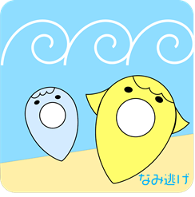

# Civictech Challenge Cup U-22

基本的には，Profileページに引用している最終審査会のアーカイブ配信をご参照していただければ基本的に内容は把握できます。ここでは，開発プロダクトの簡単な機能・技術的紹介に加えて，Civictech Challenge Cup U-22(以下CCC)の参加に至った経緯やコンテストの流れについて紹介します。

>開発プロダクト「なみ逃げ」

## コンテスト参加に至った経緯
 　学部１年次に受講していた，地理学のある必修授業回での現在の指導教員の先生が告知していたことをきっかけに本コンテストを知りました。告知を聞いた際，謎にやってみたいという思いが芽生えたのを覚えていますが，簡単に参加の決め手を説明するならば，

>- 当時，COVID-19の流行下にあり，サークルやゼミ等に所属せず，大学の講義も全面的にオンラインであったことから，コンテスト実施期間の大部分を占める夏休みの予定が特になかったため，時間のあるうちに全く技術も知識もないアプリ開発の分野に足を踏み入れてみようと思ったから

>- ただ，単純にやってみたいという好奇心だけで参加するのは惜しい気がしたが，せっかくなら自身が特別な関心を払い続けてきた災害・防災という分野と関連させながら活動できそうか考えた際，授業で学んだ[参加型GIS(Participatory GIS)](https://www.jstage.jst.go.jp/article/thagis/18/2/18_139/_pdf/-char/ja)や，[OpenStreetMap(OSM)](https://www.openstreetmap.org/#map=4/35.59/134.38)のような，**市民参加型**の地図の利用と組み合わせると面白いのではないかと考え参加に踏み切った。
　
## 開発プロダクト「なみ逃げ」について

**アプリの主な機能**

　本プロダクトは，私のほかに，東京大学・京都女子大学の学生計3名で開発したプロダクトである。開発にあたって，各個人の専門を生かすことでコンテストの限られた時間で最善を尽くすべく，自身は，アプリ自体のコンセプトや機能を主に担当した。したがって，本項目の内容はその分担内容が大部を占めることに留意されたい。

　本プロダクトの基本的な着想として，先述したOSMやVGI(Volunteered Geographic Information)のような，「市民参加型」の地図利用あるいは情報活用がある。元来，「地図」は，市民にとって「読み，その情報を基に行動」ための存在が主であり，市民はいわば地図の「消費者」であった。しかし，近年においては，**「地図の民主化」**（Haklay, 2013; 瀬戸・西村，2021）と称されるように，市民が自ら地理的な情報の「生産者」となる動きが登場・発展しつつある。そのような地図の民主化に伴う，災害に関する地理空間情報の共有を行う活動の1つに，**「クライシスマッピング」** がある。この活動は，[瀬戸(2011)](https://www.gisa-japan.org/content/files/conferences/proceedings/2011cd/papers/B-2-4.pdf)によると，
>「世界各地の災害対応や人道支援活動を行うボランティアおよび実務者らが中心となり，災害対応に関わる現地の基盤地図を含む地理空間情報を整備，共有，分析する活動」

と解釈される。一例として，ハイチ地震（2010年）やニュージーランド地震（2011年）での活動が挙げられ，日本では，東日本大震災時（2011年）の活動が端緒とされている。このような活動は，災害時に実務者あるいはボランティアが行う参加型のマッピング活動であるが，私は，この活動内容と，仁平が指摘するような「災間の思考」を融合し，次のような市民参加型の情報共有プラットフォームの構築を目指した。

### 開発に際して必要と考えた情報共有システムの内容

大別して２点あり，

- **平時，つまり日常的な生活の中で災害時に危険と思われるような地物等の情報を市民自らが，位置情報とともに，画像あるいはテキスト，動画などの情報を「マッピング」するシステム**
  - このシステムは，従来の，自治体スケール等での地域内の防災対策が何らかの場所に住民が集まり，議論するという手段のほかに，オンライン上で住民が危険場所や災害情報の共有をするという手段の可能性を与える可能性があると考えた
  - また，そのような情報の蓄積を住民間，あるいは行政や専門家も交えて評価することで，情報としての練度を高める必要がある
  - 他方，オンライン上にオープンデータ化されることで，地域内だけでなく，地域外（地域の土地勘のない観光客など）の人々に，避難場所や危険場所をビジュアライズにレコメンドする側面も期待できる

- **避難経路をオンライン上でデータベース化するシステム**
  - 自身の小学校時代を振り返り，学校と家庭での防災対策として，紙媒体かつ自筆で，自宅からの避難場所と避難経路を描画したものを共有していたことに注目した。この作業には，単に学校と家庭間の情報共有としての役割だけでなく，家庭で避難場所を **「話し合い，決定」** し，かつ避難経路を **「描く」** ことで，家庭内の防災対策を促進する役割の一端を果たしていたのではないかと考えた。しかし，地図を「描く」という作業は，個人によって描かれる情報やスケール，方角等は必ずしも統一されていない。この点に関して課題が存在すると考えたため，オンライン上で地図を  **「なぞる」** ことで，実際の地図の描画に近い差b業ができ，かつ作業として個人の地図作成能力に左右されず，統一化された作業内容によって作成され，かつ管理という側面においても，作成された避難経路をデーベース化することで，家庭・学校・企業・行政などの，様々な主体によって効率的に管理可能であると考えた

という２点のシステムをプロダクトの基本的なコンセプトとして設定し，開発を行った。

実際のアプリ遷移や機能については，アプリ内デザインの設計を担当したチームメンバーが作成したスライドが非常に端的かつ分かりやすいため，紹介する。

**技術的説明**

## CCCの流れ

>[PRタイムズプレスリリース（10月18日）](https://prtimes.jp/main/html/rd/p/000000039.000039198.html)より引用

左下にはCode for Japan代表の関治之氏も
