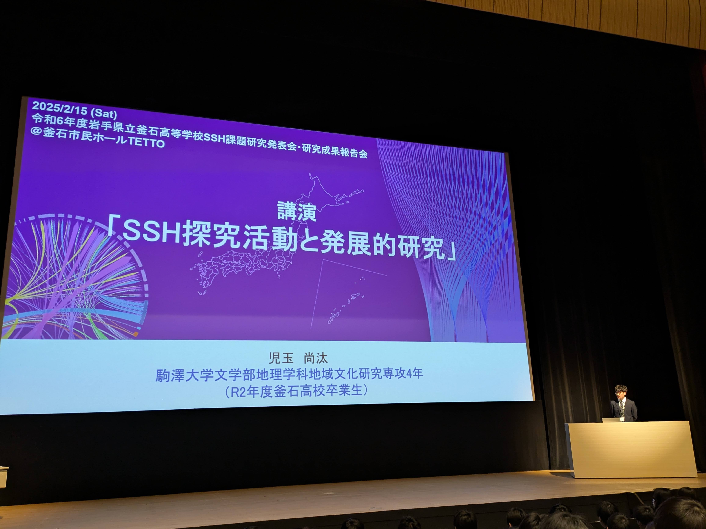

# 令和6年度岩手県立釜石高等学校SSH課題研究発表会・研究成果報告会

日時：2025年2月15日

会場：釜石市民ホールTETTO

出身校である岩手県立釜石高等学校からご依頼いただき，講演者・助言者として参加

## 講演の様子

内容としては，自身の在籍当時のSSH探究活動の関心から現在の研究への発展という過程を軸に，大学での研究活動の時系列的な紹介や研究に関する視点の議論を加えながら講演を行った。

>（瀬戸先生からご提供いただきました）
